# Coupon Box

  
## 1. 프로젝트 소개 
**쿠폰 박스**

전국 카페를 브랜드 별로 나눠 살펴본 결과 대형 커피 브랜드 10곳을 제외한 중소 브랜드 및 개인카페가 90%를 차지했다.

대형 카페가 자체 멤버십 앱을 가지고 있는데 반해, 현재 개인 카페의 경우 휴대폰 번호로 포인트를 적립하는 곳도 있으나, 대부분은 '종이 쿠폰'을 통해 도장 쿠폰을 발급하고 있다. 고객들은 여러 카페의 쿠폰을 관리하는데에 어려움을 겪고 있다. 그리고 점주도 '종이 쿠폰' 인쇄 비용, 쿠폰 관리등에 번거로움을 갖고 있다.

따라서 본 쿠폰 박스 모바일 앱은 여러 개인 카페의 쿠폰을 통합 관리하는 것을 목표로 한다.
쿠폰 박스를 통해 고객은 자신이 보유한 쿠폰의 정보를 효율적으로 관리 할 수 있고, 점주는 '종이 쿠폰' 인쇄 비용 절감, 쿠폰 발급 이력확인 등의 효과를 얻을 수 있다.

## 2. 시스템 구조
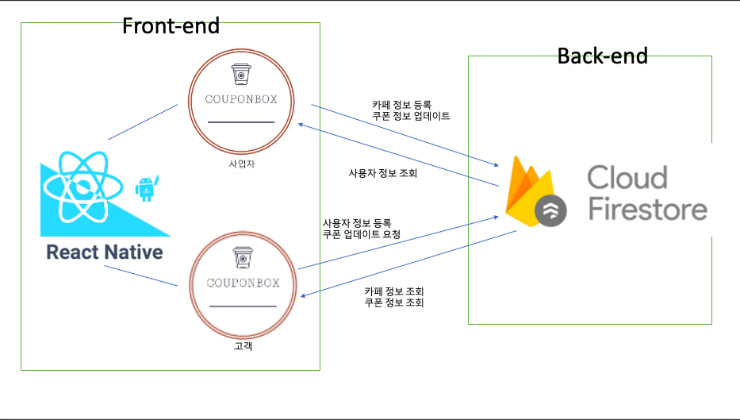 

## 3-1. 사용법 (점주)
- 회원가입 및 로그인 

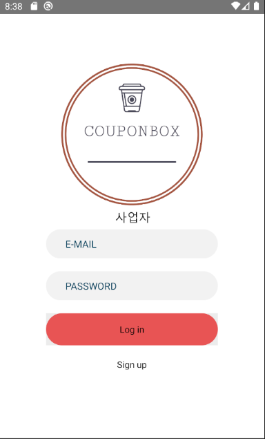  
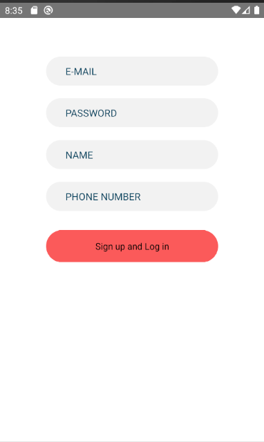

- 카페 정보 등록

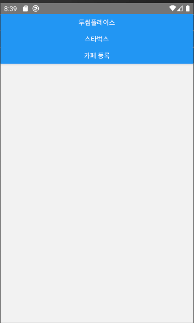  
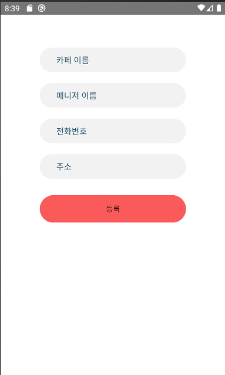

- 등록된 카페 관리 (도장 찍기 버튼 클릭 시 QR Scanner 실행)

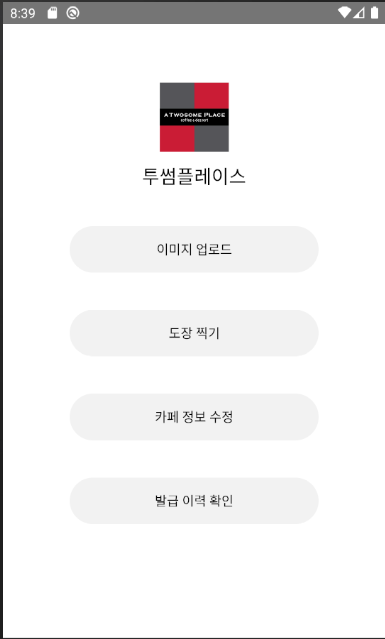
  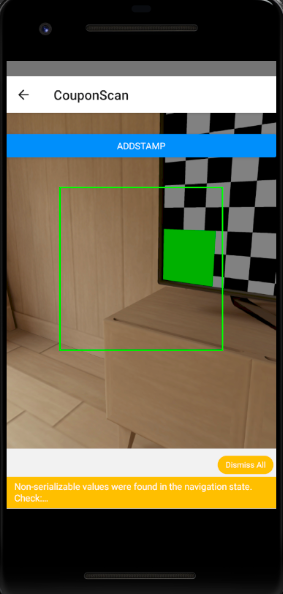

## 3-2. 사용법 (고객)
- 회원가입 및 로그인 

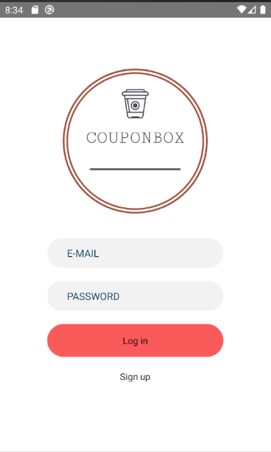  

- 고객 정보
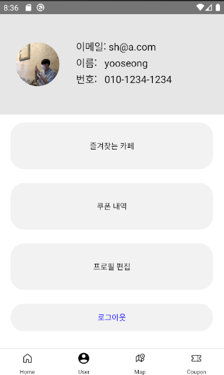

- 카페 검색 (검색 / 현재 위치에 기반한 카페 정보 제공)

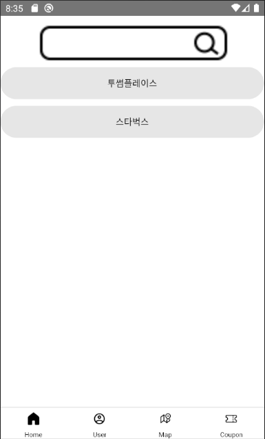
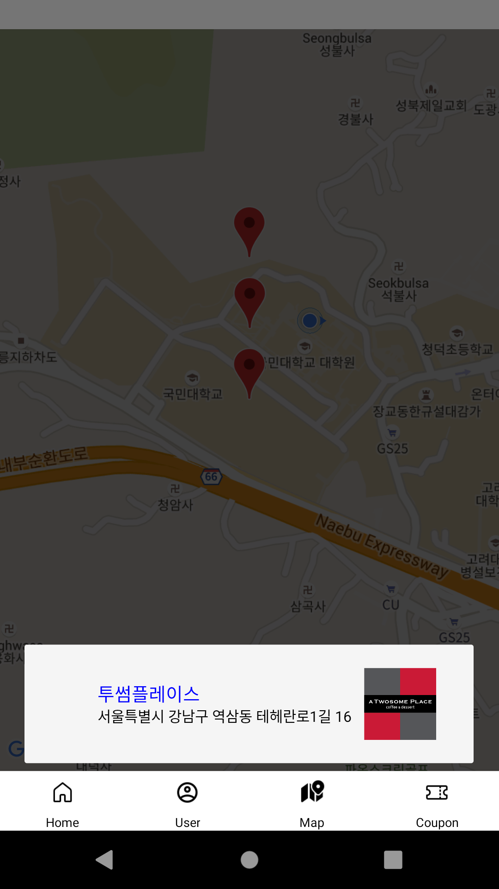

- 카페 상세 페이지
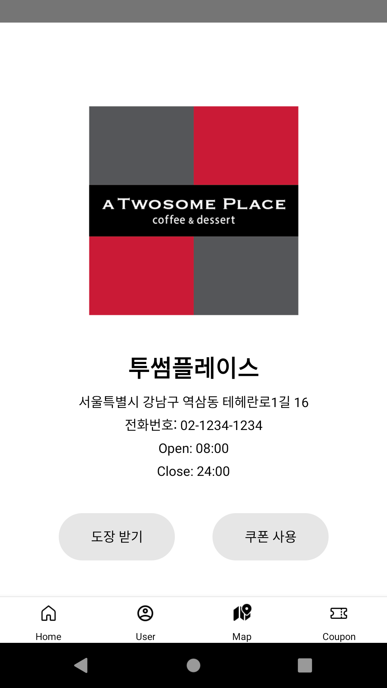

- 도장 받기 및 쿠폰 사용

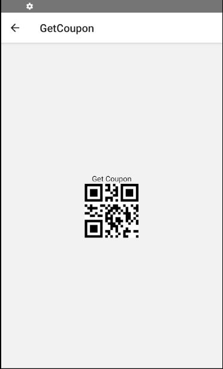
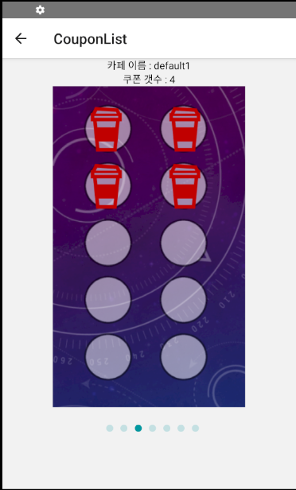
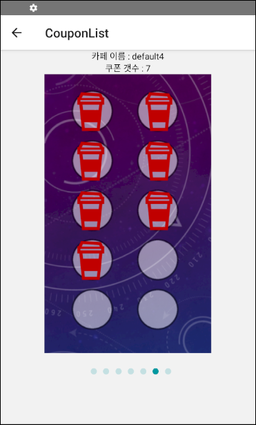
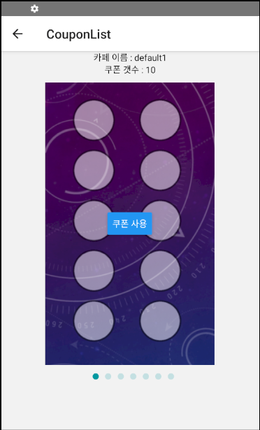

  

