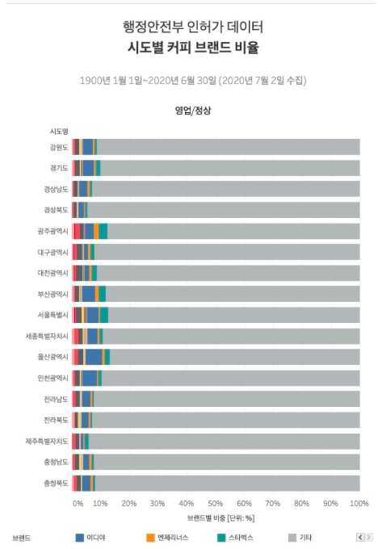

# Triple H 

  
## 1. 프로젝트 소개 
**쿠폰 박스**

대형 프랜차이즈 카페들의 경우 자체 멤버십 앱이 존재하고, 고객은 기존의 종이 쿠폰 발급이 아닌 모바일 쿠폰을 통해 효율적으로 자신의 쿠폰을 관리할 수 있다. 

그러나, 2020년 현재 서울 시내 카페 중 90%는 비 프랜차이즈 형태의 '동네 카페'이다.

현재 '동네 카페'의 경우 포스기를 통한 쿠폰 적립을 시도하는 영업점도 있으나, 대부분은 '종이 쿠폰'을 통해 쿠폰을 발급하고 있다. 고객들은 수많은 '동네 카페'의 쿠폰을 독립적으로 관리해야 하고, 이로 인해 자신의 쿠폰을 관리하는 데 큰 어려움 겪고 있다. 

'동네 카페'들의 쿠폰들을 하나의 플랫폼으로 관리할 수 있도록 해주는 '쿠폰 박스'를 통해 고객은 자신이 가지고 있는 쿠폰 정보를 잊지 않고 효율적으로 관리할 수 있다.

'점주' 입장에서는 '종이 쿠폰' 인쇄 및 자체 시스템을 통한 쿠폰 관리 등의 비용을 절감할 수 있다. 또한, 고객들에게 투명하게 쿠폰의 적립 내역을 제공해줌으로써 카페에 대한 고객들의 재방문성을 높여 '매출 증대' 효과를 기대할 수 있다.

  
## 2. Abstract
**Coupon Box**

Large franchise cafes have their own membership app, and customers can manage their coupons efficiently through mobile coupons rather than traditional paper coupons.

However, as of 2020, 90% of cafes in downtown Seoul are 'neighborhood cafes' in the form of non-franchises.

Currently, in the case of 'Neighborhood Cafe', there are branches that try to accumulate coupons through POS, but most of them issue coupons through 'paper coupons'. Customers have to independently manage coupons for numerous' 'neighborhood cafes', which is causing great difficulty in managing their own coupons.

Through the 'Coupon Box', which allows the coupons of 'neighborhood cafes' to be managed through a single platform, customers can efficiently manage their coupon information without forgetting.

For the 'store owner', it is possible to reduce costs such as printing 'paper coupons' and managing coupons through its own system. 
In addition, it is possible to expect a 'sales increase' effect by enhancing the revisitability of customers to cafes by transparently providing coupon accumulation details to customers.
   
  

## 3. 사용법 (점주)
  
- 

## 3. 사용법 (고객)
  
-
